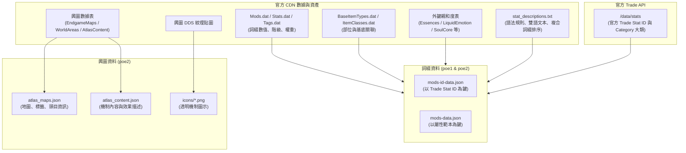

# poexd-data

Path of Exile (PoE 1 / PoE 2) 官方資料解析與自動化匯出管線。基於 TypeScript 與 `dat-schema`，100% 自 GGG 官方 CDN 提取遊戲原始數據與官方 Trade API 檢索表，轉換為結構化 JSON 與圖示資產。

---

## 系統架構與設計哲學 (Data Architecture)

### 1. 詞綴大類與親和度 (Affinity Resolution)
* **官方 Trade 命名空間 (自動)**：由 `tradeId.split('.')[0]` 自動提煉，如 `desecrated`（褻瀆）、`rune`（符文/增幅）、`enchant`（附魔）、`sanctum`（聖域）、`fractured`（破裂）、`crafted`（工藝）。
* **官方 Dat 表格外鍵 (自動)**：
  * PoE 2：`EssenceMods.dat` ➔ `essence`、`LiquidEmotionOutcomes.dat` ➔ `liquid`、`SoulCoreStats.dat` ➔ `socketable` (增幅) 與 `bonded` (命定)。
  * PoE 1：`Essences.dat` ➔ `essence`、`DelveCraftingModifiers.dat` ➔ `master`。
  * `GenerationType === 5` ➔ `corrupted`。
* **特殊影響力標籤映射 (轉接層)**：將 `Mods.dat` 中的 `destruction` (索魯德)、`berserking` (沃拉娜)、`marksman` (克洛爾)、`decay` (卡特拉)、`chronomancy` (烏特雷)、`soul` (梅德偉) 及創生之樹標籤映射至對應親和度。

### 2. 裝備部位 (Gear Types)
* **基底固有詞綴 (自動)**：自 `BaseItemTypes.dat` 的 `ItemClassesKey` 自動解析對應部位。
* **生成權重標籤轉接 (`gear-types.ts`)**：GGG 的 `Mods.dat` 採用抽象權重標籤（如 `destruction`、`weapon`、`str_armour`），透過 `POE2_TAG_TO_GEAR_TYPES` 精準對應至前端篩選器的物品代號（如 `ALL_POE2_WEAPONS`、`['claw', 'claws']`）。

### 3. 詞綴文本與 Trade ID 映射 (Stat Descriptions & Trade Matching)
* **中英文文本渲染 (自動)**：直接由官方 `stat_descriptions.txt` 語法樹編譯解析，支援複合多行詞綴（Compound Stats）的官方規則行排序。
* **Trade ID 適配 (自動 + 正規化)**：以 `cleanStatString` 消除遊戲文本與 Trade API 的風格差異（如過濾 `(Local)` 標記、折疊 `+#%` 連續符號、適配 `Bonded:` 前綴），實現 PoE 1 **98.7%** 與 PoE 2 **97.1%** 的超高匹配率。

---

## 原始碼地圖與組裝關聯 (File Map)

```
src/
├── bootstrap.ts                     # 全域環境補丁 (Node.js wasm fetch polyfill)
├── index.ts                         # CLI 入口點與任務調度器 (all / atlas / mods)
├── cdn/
│   ├── loader.ts                    # CDN Bundle 串流加載器、記憶體與磁碟雙層快取、Dat 解析
│   └── version.js                   # PoE 1 / PoE 2 最新客戶端版本偵測
├── mods/
│   ├── common/
│   │   ├── types.ts                 # 詞綴產出結構定義 (ModTierOutput, TradeStatEntry 等)
│   │   ├── stat-descriptions.ts     # GGG 官方 stat_descriptions.txt 語法解析器與渲染引擎
│   │   ├── trade-stats.ts           # Trade API 下載、快取與語意標準化比對索引 (TradeStatIndex)
│   │   └── unmatched-reporter.ts    # 未配對報告生成器與 GitHub Actions Step Summary 整合
│   ├── poe1/
│   │   ├── gear-types.ts            # PoE 1 裝備部位與 Tag 映射表
│   │   ├── affinities.ts            # PoE 1 親和度判定 (精髓、工藝、腐化、塑界等)
│   │   └── generate-mods-poe1.ts    # PoE 1 詞綴全流程生成管線 (StatsKey 欄位結構)
│   └── poe2/
│       ├── gear-types.ts            # PoE 2 裝備部位與符文/創生之樹 Tag 映射表
│       ├── affinities.ts            # PoE 2 親和度判定 (方案 B：Trade 前綴 + 外鍵 + 影響力)
│       └── generate-mods-poe2.ts    # PoE 2 詞綴全流程生成管線 (StatValue 陣列結構 + 符文石)
└── atlas/
    ├── generate-atlas-maps.ts       # PoE 2 輿圖地圖資訊提取
    ├── generate-atlas-content.ts    # PoE 2 輿圖機制與效果描述提取
    └── generate-atlas-icons.ts      # PoE 2 輿圖 DDS 紋理抽取與 PNG 轉換
```

### 官方資料生成組裝流向



---

## 產出資料 (位於 `output/`)

```
output/
├── version.json                     # PoE 1 與 PoE 2 Patch 版本及時間戳
├── poe1/
│   ├── mods-id-data.json            # PoE 1 詞綴階級表 (以官方 Trade Stat ID 為 key)
│   ├── mods-data.json               # PoE 1 屬性分組範本表 (以英文 template 為 key)
│   └── unmatched-report.json        # PoE 1 未配對報告 (含匹配率、頻率匯總與詳細清單)
└── poe2/
    ├── atlas_maps.json              # 輿圖地圖名稱、標籤、頭目與中英雙語對照
    ├── atlas_content.json           # 輿圖機制內容、效果描述、圖示名稱
    ├── icons/                       # 輿圖機制透明 PNG 圖示 (36 張)
    ├── mods-id-data.json            # PoE 2 詞綴階級表 (以官方 Trade Stat ID 為 key)
    ├── mods-data.json               # PoE 2 屬性分組範本表 (以英文 template 為 key)
    └── unmatched-report.json        # PoE 2 未配對報告 (含匹配率、頻率匯總與詳細清單)
```

---

## 使用方式

```bash
# 安裝依賴
pnpm install

# 執行完整資料生成 (PoE 1 + PoE 2 輿圖、圖示、詞綴)
pnpm run build

# 僅生成詞綴資料 (包含未配對報告)
pnpm run build:mods

# 僅生成輿圖資料
pnpm run build:atlas
```

### CI / 自動化監控
在 GitHub Actions 環境執行時，管線會自動辨識 `$GITHUB_STEP_SUMMARY`，將詞綴匹配率與 Top 10 未配對詞綴清單直接渲染至 Actions Job 摘要頁面中。

---

## 自動化與 CDN 存取

GitHub Actions (`.github/workflows/deploy.yml`) 支援定時排程與手動觸發，構建完成後將自動發布至 `gh-pages` 分支。

### CDN 端點 (jsDelivr)

* **版本中繼資訊** (極速檢查)：
  `https://cdn.jsdelivr.net/gh/<owner>/poexd-data@gh-pages/version.json`
* **PoE 2 輿圖地圖**：
  `https://cdn.jsdelivr.net/gh/<owner>/poexd-data@gh-pages/poe2/atlas_maps.json`
* **PoE 2 輿圖機制**：
  `https://cdn.jsdelivr.net/gh/<owner>/poexd-data@gh-pages/poe2/atlas_content.json`
* **PoE 2 輿圖圖示**：
  `https://cdn.jsdelivr.net/gh/<owner>/poexd-data@gh-pages/poe2/icons/{IconName}.png`
* **PoE 2 詞綴階級**：
  `https://cdn.jsdelivr.net/gh/<owner>/poexd-data@gh-pages/poe2/mods-id-data.json`
* **PoE 1 詞綴階級**：
  `https://cdn.jsdelivr.net/gh/<owner>/poexd-data@gh-pages/poe1/mods-id-data.json`

---

## License

本專案採用 [MIT License](LICENSE)。

*This project is not affiliated with, funded, or endorsed by Grinding Gear Games in any way. Path of Exile, Path of Exile 2, and all associated assets are trademarks or registered trademarks of Grinding Gear Games.*
